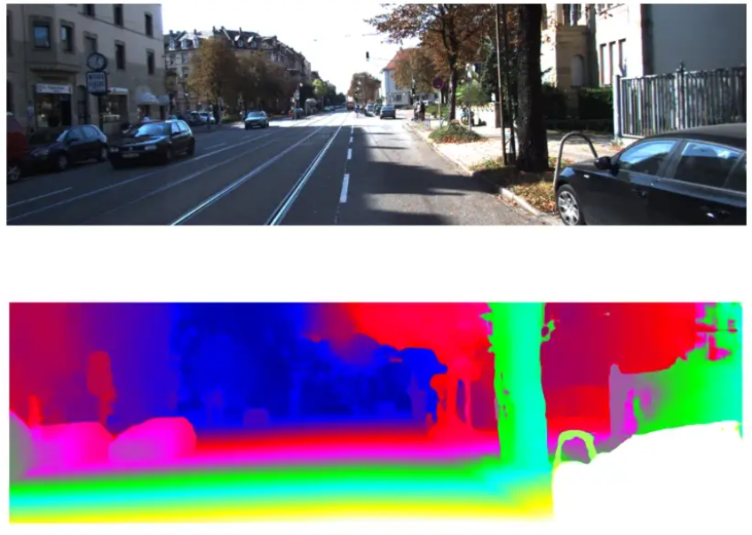

# Reproducing-PSMNet

 

## Overview
This is a reproduction of the CVPR 2018 paper ["Pyramid Stereo Matching Network"](https://arxiv.org/abs/1803.08669). This repository contains code to calculate end-point error on Scene Flow dataset and to visualize the training and validation loss.

Before starting to work on the code read our [blog post](

https://medium.com/tu-delft-deep-learning-project/reproducing-pyramid-stereo-matching-an-advancement-in-disparity-image-generation-a91255ea1419) on the same. 

We have provided files that we made to calculate the end point error and visualizing the training loss. 
To know more please refer to [this](https://github.com/JiaRenChang/PSMNet) repository .

## File description

1. `reproduce.py`                    - Calculates the end point error

2. `finetune.py`                     - This file is same as from the original repository with additional code to store losses.

3. `training_and_validation_plot.py` - Plots the training and validation loss.

## Calculating the end point error

* **Step 1**: 
Clone the PSMNet repository from the above link. 

* **Step 2**:
 Clone this repository.

* **Step 3**:
 Copy the files from this repository and paste it under the directory */your_path/PSMNet-master/*

* **Step 4**:
 Specify the path to your trained or pretrained model in the `reproduce.py` and also to the folder containing Scene FLow test dataset.

* **Step 5**:
 Run the code to obtain the end point error of your model.

##  Visualzing the training and test loss

* Run the script `finetune.py` that you copy pasted from this repository. This will save a file containing all losses that occurred during finetuning.

* Run the script `training_and_validation_plot.py`. You will see your training and validation loss printed to the console.

